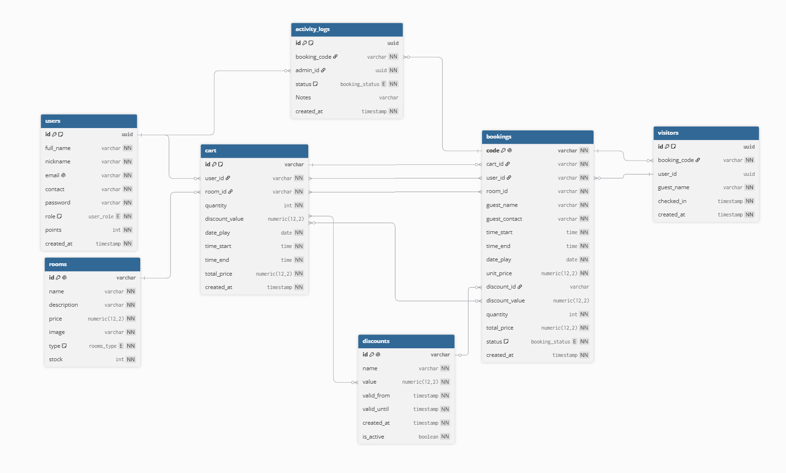

# CORE-BACKEND

## SETUP
### 1. Clone & Install
```bash
git clone https://github.com/Revou-FSSE-Feb26/crack-be-MicelHiu.git
cd crack-be-MicelHiu
npm install
```
### 2. Environment Variables
.env.example
```bash
DATABASE_URL="postgresql://postgres:<your password>@<your-host>:5432/postgres"
JWT_SECRET="<long_random_string>"

# optional — without this, forgot-password just logs the reset link instead of emailing it
SMTP_HOST="smtp.gmail.com"
SMTP_PORT="587"
SMTP_USER="<sender email>"
SMTP_PASS="<app password>"
MAIL_FROM="<sender email>"

# optional — the deployed frontend domain, used for CORS & the password reset link
FRONTEND_URL="https://core-six-gold.vercel.app"
```
copy ".env.example" to ".env" file
```bash
cp .env.example .env
```
### 3. Database Migration
```bash
npx prisma migrate dev
npx prisma generate
npx prisma studio
```
### 4. Run the application
```bash
# development
npm run start:dev

# production
npm run build
npm run start
```
---
## ERD

---
## ARCHITECTURE OVERVIEW
### Layered structure
Every domain (auth, users, rooms, carts, bookings, discounts, visitors, activity-logs) follows the same 3-layer NestJS pattern:
Controller  → receives the HTTP request, validates the DTO, delegates to the Service
Service     → business logic (ownership checks, status-transition validation, stock checks, etc.)
Repository  → the only layer that talks to Prisma / the database

The Controller never calls Prisma directly. Calls flow through Service → Repository instead, which keeps query logic easy to change without touching the HTTP layer.

### Modules
| Module | Responsibility |
|---|---|
| AuthModule | register/login, forgot/reset password via an emailed token, JWT issuing, hosts JwtAuthGuard & RolesGuard so they can be exported to other modules |
| UsersModule | the currently logged-in user's data (`/users/current`) |
| RoomsModule | room CRUD (PC/PS), computes remaining stock per day |
| CartsModule | a user's booking cart before checkout |
| BookingsModule | checks out a cart into a booking, status transitions (confirmed → ongoing → completed / canceled), user-initiated cancel |
| DiscountsModule | promo/voucher CRUD, validates the active period |
| VisitorsModule | visitor listing & stats, search by guest name / booking code / customer |
| ActivityLogsModule | history of booking status changes |
| MailModule | nodemailer wrapper, used by AuthModule to send the password reset link |
| PrismaModule | wraps PrismaService, imported by every module that needs DB access |

### Request pipeline
Request
  → LoggerMiddleware (global, every route — app.module.ts)
  → ThrottlerGuard (per-route, on sensitive auth endpoints — rate limiting)
  → JwtAuthGuard (per-controller/route — verifies the Bearer token, populates req.user)
  → RolesGuard (specific routes — checks req.user.role against @Roles() metadata)
  → Controller → Service → Repository → Prisma → PostgreSQL

### Auth
- JwtAuthGuard reads the `Authorization: Bearer <token>` header, verifies it with JwtService, then injects the payload into `req.user` (consumed via the `@CurrentUser()` decorator). A token carrying a `purpose` (password reset) is deliberately rejected here, so it can't be reused as a login token.
- Role-based access uses `@Roles('admin')` (metadata) + `RolesGuard` (reads that metadata via Reflector).
- Forgot-password never reveals whether an email is registered: the response is always the same, and the reset link (a JWT valid for 15 minutes) is only emailed if the user actually exists.

### Database
- The schema is defined in `prisma/schema.prisma`, accessed through `PrismaService` (a PrismaClient wrapper) injected into each `*.repository.ts`.
- Main relationships: `users` 1—N `carts`/`bookings`/`visitors`/`activity_logs`; `rooms` 1—N `carts`/`bookings`; `discounts` 1—N `carts`/`bookings`; `bookings` 1—N `visitors`/`activity_logs`.

## KNOWN LIMITATIONS
- **No pagination.** `GET /rooms`, `GET /carts`, `GET /bookings`, `GET /discounts`, and `GET /visitors` return every row (`findMany()` with no `take`/`skip`) — this will become a problem as data grows.
- **A room can't be deleted once it has a booking** (to keep transaction history intact) — admins should set its stock to 0 instead.

## TECH STACK
- Framework: Nest.js, Prisma
- Database: PostgreSQL
- Deployments: Railway
- Link Production: [railway production](https://core-backend-production-d8cd.up.railway.app)
- Link API: [Swagger docs](https://core-backend-production-d8cd.up.railway.app/api-docs)
